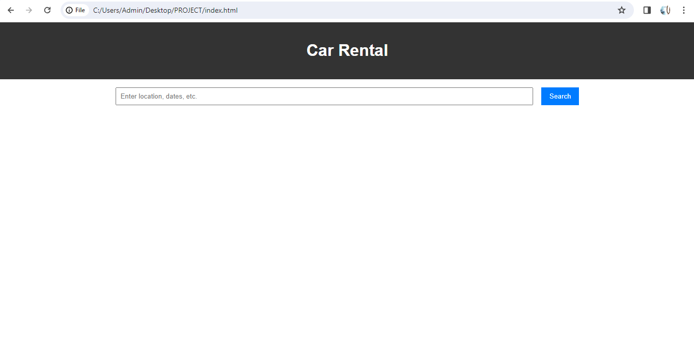

**Car Rental Application using Django Framework**

---

**Introduction:**
This project is a car rental application developed using the Django web framework. It allows users to rent cars for a specified duration by browsing through available vehicles, making reservations, and managing their bookings.

---

**Features:**
1. User Authentication: Users can register, login, and logout securely.
2. Browse Cars: Users can view available cars with details such as model, make, year, and price per day.
3. Rent Cars: Users can select a car, specify rental duration, and make a reservation.
4. Manage Bookings: Users can view their current and past bookings, including details like rental duration and total cost.
5. Admin Panel: Admins can manage cars, bookings, and users through an intuitive admin interface provided by Django.

---
**Screenshots:**
1. home page:
   

2. Car Listings:
   

3. booking Form:
   

4. contact form:
   

5. about us:
   

---

**Presentation:**
A PowerPoint presentation containing an overview of the project, its features, architecture, and future enhancements, along with the screenshots, is available [here](link_to_presentation).

---
